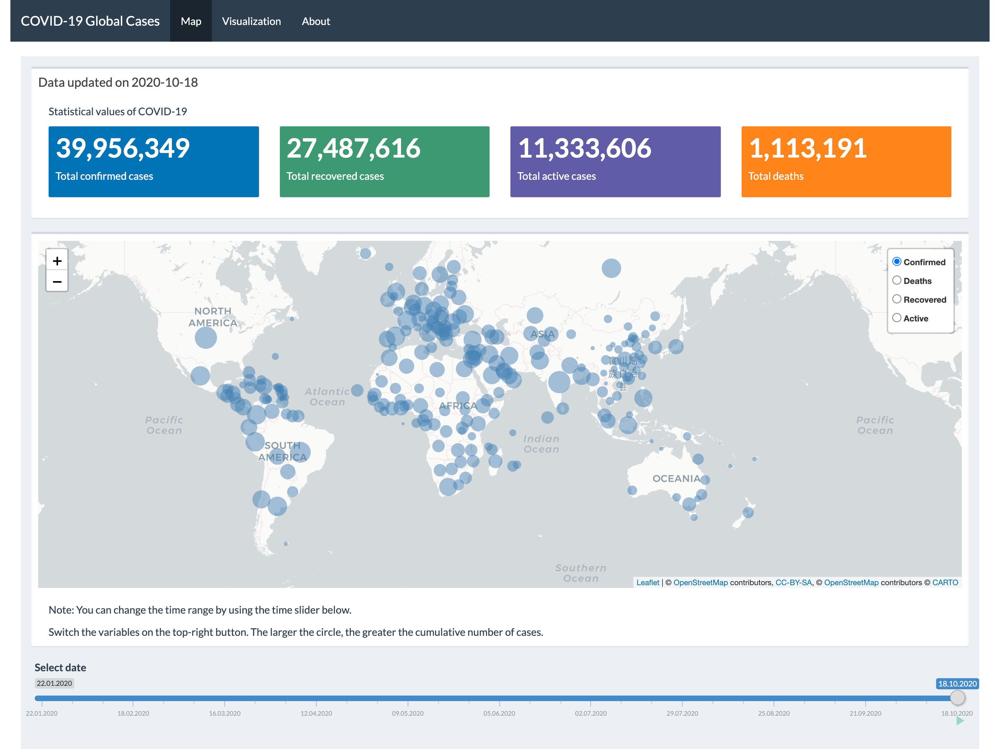
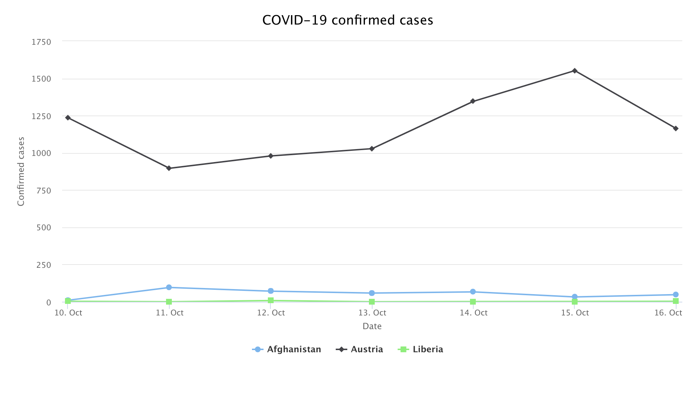

<!-- README.md is generated from README.Rmd. Please edit that file -->

covid19
=======

<!-- badges: start -->

<!-- badges: end -->

:book: Overview
---------------

The `covid19` package provides an overview of the COVID-19 epidemic with
built-in Shiny app `COVID-19 Global Cases`, which can help the user to
get some insights about the development of COVID-19 quickly. Also, some
built-in functions may allow you to make some changes for the built-in
Shiny app. You can learn more about them in
[vignette](https://etc5523-2020.github.io/r-package-assessment-cuiping-wei/).

:house: Installation
--------------------

You can get the development `covid19` from [GitHub](https://github.com/)
with:

    # install.packages("devtools")
    devtools::install_github("etc5523-2020/r-package-assessment-cuiping-wei")

:art: Usage
-----------

    library(covid19)

`covid19` package has the following functions:

-   `launch_app()` to launch built-in Shiny app.  
-   `ui_page()` to create a shiny dashboard page for using in Shiny
    app.  
-   `valuebox()` to output Shiny valueBox.
-   `input_type()` to create a input module for Shiny app.  
-   `plot_highchart()` to create a interactive highchart plot.
-   `plot_linechart()` to create a line plot.

If you would like to have a tutorial for using this Shiny App, please
visit this
[article](https://etc5523-2020.github.io/r-package-assessment-cuiping-wei/articles/app.html).

:hand: Getting help
-------------------

If you encounter any bugs, please post an issue on
[Github](https://github.com/etc5523-2020/r-package-assessment-cuiping-wei/issues).
If you have any questions and suggestions you would like to discuss,
please feel free to contact me by email
(*<a href="mailto:cwei0018@student.monash.edu" class="email">cwei0018@student.monash.edu</a>*).

:star2: Example
---------------

There are some basic examples which show you how to explore `covid19`
package:

#### Launch Shiny app

    ## launch Shiny app
    library(covid19)
    launch_app()

#### Creating highchart plot

    ## create a highchart plot
    library(magrittr)
    library(dplyr)
    library(coronavirus)
    library(covid19)

    data("coronavirus")
    data <- coronavirus %>%
            filter(date >= '2020-10-10') %>%
            filter(country %in% c("Afghanistan", "Liberia", "Austria")) %>%
            filter(type == "confirmed")

    plot_highchart(df = data, x = date, y = cases, group = country, ylabs = 'Confirmed cases',
                   xlabs = 'Date', title = 'COVID-19 confirmed cases')

