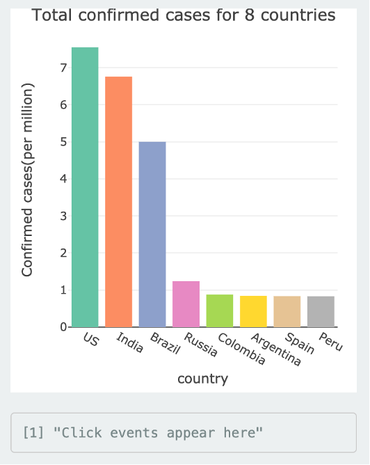

```{r, include = FALSE}
knitr::opts_chunk$set(
  collapse = TRUE,
  comment = "#>"
)
```

```{r setup}
library(covid19)
```

## How to launch this app

### Installation

#### Software

- [R](https://cran.r-project.org/bin/windows/base/)
- [Rstudio](https://rstudio.com/products/rstudio/download/)(R version 4.0.2)


#### Packages

- COVID-19 data packages (Github version)

``` r
install.packages("devtools")
devtools::install_github("RamiKrispin/coronavirus")
```

- Other packages 

``` r
install.packages(c("dplyr", "wbstats", "tidyverse", "leaflet", "scales", "shiny", "shinydashboard", "shinyWidgets", "highcharter", "htmltools", "plotly", "DT", "shinythemes", "covid19", "rlang"))
```

#### Launch the app

You can run this shiny app simply by using the following code: 

```r
launch_app()
```

#### Update data

The [coronavirus](https://github.com/RamiKrispin/coronavirus)(Github version) is updated on a daily bases. The `update_dataset` function can obtain the most recent data from Github, and this function is embeded into this shiny web app. If you want to explore the latest COVID-19 data worldwide, you can choose 'Y' after running the following code.  

``` r
update_dataset(silence = FALSE)
```

**Note:** R session will be restarted to obtain the latest data.


## What it does?

This Shiny web app is mainly for updating real-time data of COVID-19, simple visualization and comparison of different countries with graphs and table, rather than comprehensive analyses or model prediction. Next, I'm going to give you a brief overview of what this app does.  

- **Update data**

To obtain the latest data, you can use `update_dataset()` function.  

- **Global COVID-19 overview**

You can find a brief statistical overview for cases on this app.

> 


If you want to see how COVID-19 cases have changed in countries around the world since the outbreak began or over a certain period, you can use Date Slider to select a date range and show the animation on a map. Also, you can choose the variables you want to explore, such as confirmed, death, recovered and active.  

> 

<br>

- **Visualization**

There are three graphs and one table in visualization page, all of which can be updated by user input.
 
> 

<br>

You can select the country you are interested in the above input panel and explore them in the bar chart, which will provide you with a visualization of the total confirmed cases in your chosen country.

> 

<br>

You can click on the above bar chart to see which countries you would like to explore further, and then the following line chart will be updated by your chosen country. The line chart shows the number of confirmed cases, recovered cases, and deaths on a logarithmic scale over time.  

> 

<br>

You can explore the comparison of confirmed rates and mortality rates between different countries.  

> 

<br>

You can find statistical values, the specific number of cases, and the rates of cases in the Summary Table.  

> 


