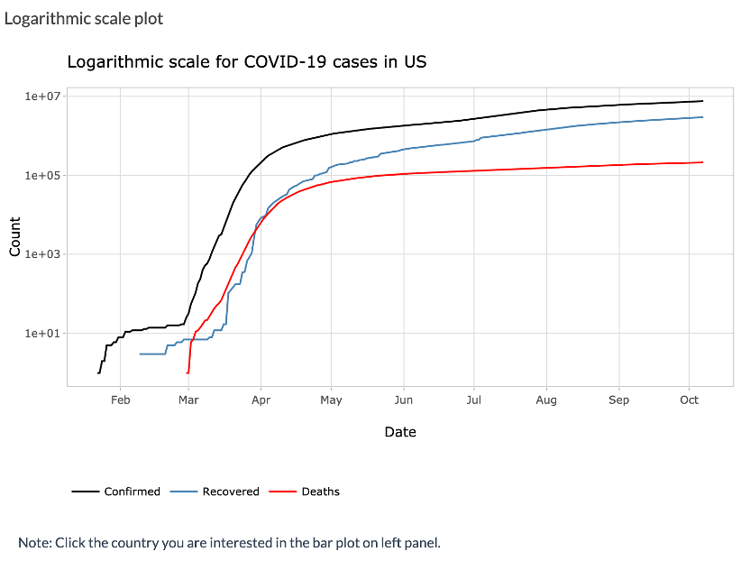

```{r, include = FALSE}
knitr::opts_chunk$set(
  echo = FALSE,
  message = FALSE,
  warning = FALSE,
  collapse = TRUE,
  comment = "#>",
  fig.path = "images/",
  out.width = "80%",
  out.height = "80%"
)
```

```{r setup}
library(covid19)
```


This vignette is to introduce the built-in Shiny app in `covid19` package that details how to launch it, what it does, and guidelines for usage.  

## How to launch this Shiny app?

### Installation

- `coronavirus` and `covid19` (Github version)

``` r
#install.packages("devtools")
devtools::install_github("RamiKrispin/coronavirus")
devtools::install_github("etc5523-2020/r-package-assessment-cuiping-wei")
```

- Other packages 

``` r
install.packages(c("dplyr", "wbstats", "tidyverse", "leaflet", "scales", "shiny", "shinydashboard", "shinyWidgets", "highcharter", "htmltools", "plotly", "DT", "shinythemes", "rlang", "magrittr"))
```

### Usage

#### Launch the app

You can launch this shiny app simply by using the following code: 

```r
launch_app()
```

#### Update data

The [coronavirus](https://github.com/RamiKrispin/coronavirus)(Github version) is updated on a daily bases. The `update_dataset` function can obtain the most recent data from Github, and this function is embeded into this shiny app in the package `covid19`. If you want to explore the latest COVID-19 data worldwide, you can choose 'Y' when you get the following tip.

``` r
Updates are available on the coronavirus Dev version, do you want to update? n/Y
```

**Note:** R session will be restarted to obtain the latest data.

<hr>


## What this Shiny app does?

This Shiny app is mainly for updating real-time data of COVID-19, simple visualization with interaction and comparison of different countries with graphs and table, rather than comprehensive analyses or model prediction. 
<br>
There are three sections in this Shiny app as shown below:

- Map: Using ValueBoxes to show the total number of cases, and using map and slider to animate the daily cases for confirmed, deaths, recovered and active.

- Visualization: Allowing users to use different input modules to explore plots and table.

- About: Providing the story and data source of this app.


<hr>

## Guidelines

### Map

You can find a brief statistical overview for global COVID-19 cases on this app, as shown in Figure 1.

<center>
```{r plot1, fig.cap= 'Figure 1: Statistical overview for global COVID-19 cases'}

```
</center>

<br>
<hr>
If you want to see how COVID-19 cases have changed in countries around the world since the outbreak began or over a certain period, you can use Date Slider to select a date range and show the animation on a map. Also, you can choose the variables you want to explore, such as confirmed, death, recovered and active, as shown in Figure 2.

<center>
```{r plot2, fig.cap= 'Figure 2: Dynamic map for global COVID-19 cases'}
knitr::include_graphics('images/Picture2.png')
```
</center>

<br>
<hr>
### Visualization

There are three graphs and one table in visualization page, all of which can be updated by user input(Figure 3).

<center>
```{r plot3, fig.cap= 'Figure 3: Input modules for Shiny app'}
knitr::include_graphics('images/Picture3.png')
```
</center>

<br>
<hr>
On Figure 4, you can select the country you are interested in the above input panel and explore them in the bar chart, which will provide you with a visualization of the total confirmed cases in your chosen country.

<center>
```{r plot4, fig.cap= 'Figure 4: Bar chart for total confirmed cases'}
knitr::include_graphics('images/Picture4.png')
```
</center>

<br>
<hr>
You can click on the above bar chart to see which countries you would like to explore further, and then the following line chart will be updated by your chosen country. The line chart shows the number of confirmed cases, recovered cases, and deaths on a logarithmic scale over time, as shown in Figure 5.  

<center>
```{r plot5, fig.cap= 'Figure 5: Line chart for COVID-19 cases on a logarithmic scale over time'}

```
</center>

<br>
<hr>
You can explore the comparison of confirmed rates and mortality rates between different countries, as shown in Figure 6.   

<center>
```{r plot6, fig.cap= 'Figur 6: Confirmed rates and mortality rates between different countries'}
knitr::include_graphics('images/Picture6.png')
```
</center>

<br>
<hr>
You can find statistical values, the specific number of cases, and the rates of cases in the Summary Table, as shown in Figure 7.  


<center>
```{r plot7, fig.cap= 'Figure 7: Confirmed rates and mortality rates between different countries'}
knitr::include_graphics('images/Picture7.png')
```
</center>
<hr>
## Session info {.unnumbered}

```{r}
sessionInfo()
```


